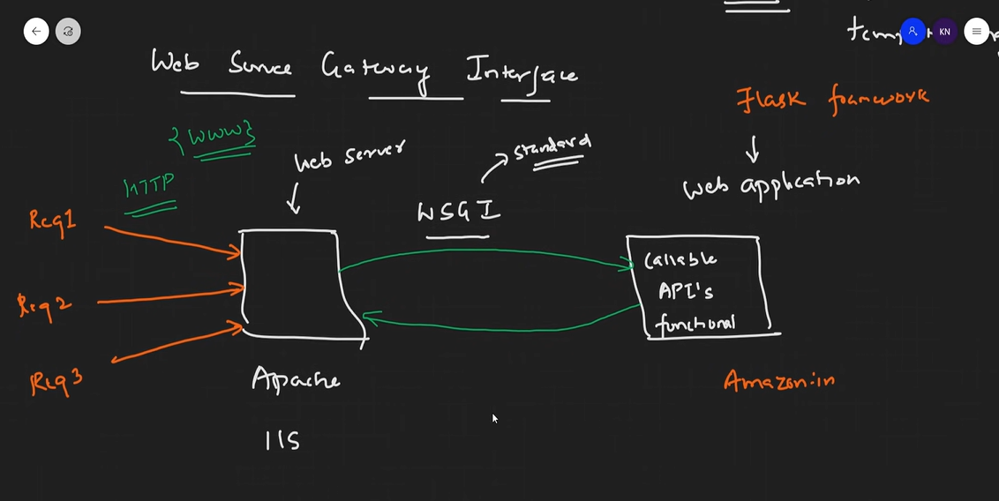
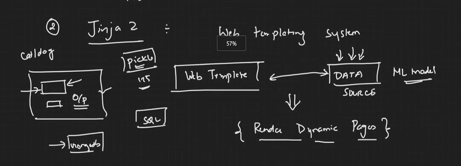
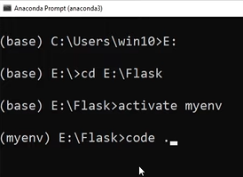

# Flask Notes

- Flask - Python web framework that can be used for developing web applications. Also for creating web apis, creating ML applications where you're developing a lot of end to end projects
- Developed by Armin Ronacher. Leads a group of International Python enthusiasts / developers named Pocco. 
- Flask is based on WSGI concepts and JINJA2 template engine.
- WSGI : Web Server Gateway Interface. A standard / a protocol.  
<b>Explanation</b>: Web applications are hosted in a web server (Apache, IIS). Whenever a request to access the hosted a web application is sent to the web server, a request is sent from the web server to the web application. Now there will be a standard or a protocol by which this request & response communcation happens between the web server and the web application. For this communication, we use something known as WSGI (Web Server Gateway Interface). The web application will contain callable functions, APIs, functionalities which would get called and the response will be received at the web server's end.  

  

- JINJA2 : a Web templating system. It basically combines a web tempalte along with a certain data source. The data source will dynamically put the data into the template and render the dynamic page.  
<b>Example </b>: Suppose we have a ML application, whose aim is to classify whether the given image is a cat or a dog. The image is to be uploaded and submitted via the web page, at the backend level, it is processed by the ML model (either the pickle file or the .h5 file of the ML model) and upon submission, the response (here, the output of the ML model) is to be displayed on the webpage `dynamically` (the web page is dynamically rendered).  

  

- Since the `POCCO Group` is heading all of this, the WSGI and JINJA2 are called `POCCO PROJECTS` .

### Creating an environment (for the project)
Overview: If needed, an environment is to be created and you gotta launch vs code in that environment. This guy had done it via anaconda. But Imma do it from my VS Code. For any future probable errors - Jai Maatha Di!
 
Apparently whenever this guy lears something, he creates an environment. Not me brother.
 

 
`activate myenv` : activates an environment called 'myenv' at the current path
`code .` : opens and launches VSCode at the current folder
 
- [Read more](https://dev.to/mursalfk/setup-flask-on-windows-system-using-vs-code-4p9j)

### The requirements.txt file
- requirements.txt file : constains the list of libraries to be installed. Example : `flask==3.0.0` indicates the flask module, version 3.0.0; the version is optional.
- `pip install -r .\requirements.txt` : installs all the required libraries of a particular project.

## Understanding a sample flask web application skeleton
- `if __name__ == '__main__':` = starting point of program execution.
- `app = Flask(__name__)` = `app` here is the object of Flask app. The way that we've now created the object of the Flask app, this is our WSGI application, which will be interacting / communicating with the server.
- The decorator : `@app.route()`, takes two parameters - rule (string type : url of the webpage. `/` means root) and methods (POST, GET, , ).
- `app.run()` : takes 4 parameters. `debug=True` will keep refreshing the application & keeps restarting the server as and when you save the code. Others are `host` and `port` which are handy when deploying it on the server.
- You cannot use the same function name for two decorators (two different urls)

## Building URLs dynamically
### Flask variable rules and URL binding
`@app.route('/success/<int:score>')` : the url also carries an integer variable called `score`. If its a string variable, we use `<score>`.
This is basically building urls dynamically using variables.
We can use the following two libraries:
1. `redirect` : ensures that it redirects to some web page / url.
2. `url_for` : used for creating this url. Has two parameters - which page you wanna redirect to & the required parameters of that url. <b>Note:</b> the url is the string you provide inside the app.route() decorator you want to redirect to, not the function of the decorator. Also the rest of the parameters you provide gotta be provided as `parameter_name = argument_value` and not just `argument_value`. Otherwise you may encounter 
`TypeError: url_for() takes 1 positional argument but 2 were given` 

## Integrating HTML with FLASK Web Framework with HTTP VERBS (GET and POST)
Libraries required: 
1. render_template - helps rendering a HTML page. Uses a folder structure: `'root/template'` folder contains html files. `'root/static/css'` contains CSS files. `'root/static/script'` contains JS files.
Syntax : `return render_template('index.html')` returns the rendered html template.

2. request - helps in reading the values received from forms that use POST to get data from the user.
### Integrate HTML with FLASK
the `<form action="/submit" method="post">` in HTML should match `@app.route('/submit',methods=['POST','GET'])` in the flask application.
### HTTP verb GET and POST
- POST : the user posts data
- GET : 

## Understanding Jinja2 template engine in Flask Web framework
3 ways :
1.  for conditional statements
2. {{   }} expressions to print output
3. {#   #} this is for comments.

# Integrating CSS and Javascript in Flask Web Framework
To add CSS using jinja template to a HTML file, do the following in the html file:
Inside the `<head>` tag --> `<link rel="stylesheet" href="{{ url_for('static',filename='css/style.css') }}"> </link>`  
To add JS using jinja templlate to a HTML file, do the following in the html file:
Inside the `<head>` tag --> ``

# Face Recognition project in Flask Web Framework - separate project
(Will link the repo shortly)